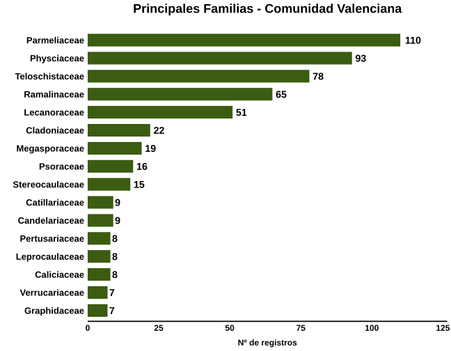
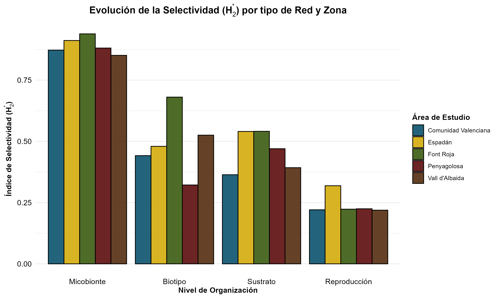
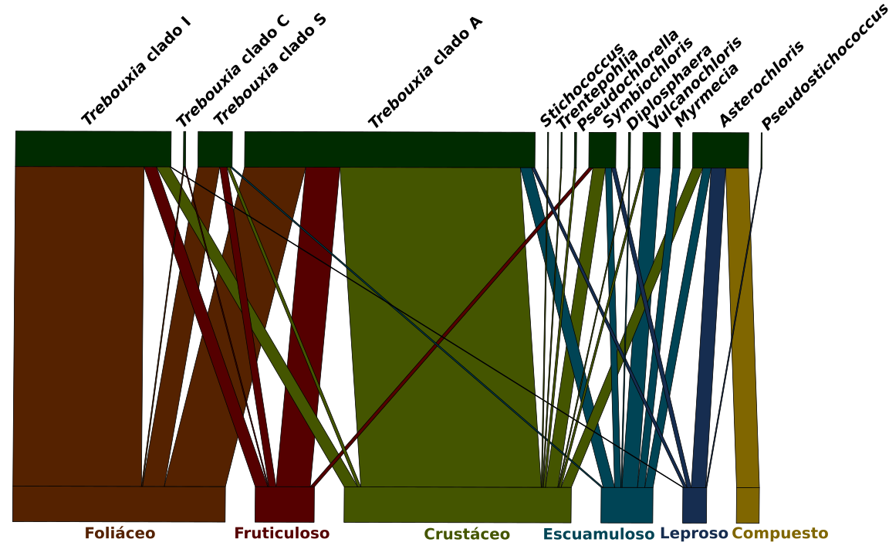

# 🍄 Lichen-Symbiont Interaction Networks

**Investigadora:** Irene Mahiques Andrés  
**Especialidad:** Biología de Sistemas | Ecología Molecular  
**Contacto:** [LinkedIn](https://www.linkedin.com/in/irene-mahiques)

## 🎯 Resumen del Proyecto
Este repositorio documenta el pipeline de **análisis bioestadístico y modelado de redes** desarrollado para mi Trabajo de Fin de Grado (TFG). El proyecto modela las interacciones biológicas entre micobiontes y fotobiontes en ecosistemas de montaña de la Comunidad Valenciana (Sierra de Espadán, Font Roja, Penyagolosa y Vall d'Albaida).

**💡 Valor Tecnológico e Industrial:**  
Las metodologías de modelado matemático de redes aquí presentadas son aplicables a:
*   **Análisis de Microbiomas:** Caracterización de perfiles complejos.
*   **NAMs (Métodos Alternativos):** Biología de sistemas aplicada a validación toxicológica.
*   **Biomarcadores:** Detección de "nodos clave" en ecosistemas perturbados.

---

## 📂 Estructura del Repositorio
*   [`/scripts`](./scripts): 
    *   `01_curacion_datos.R`: Normalización taxonómica y limpieza ortográfica.
    *   `02_diversidad_taxonomica.R`: Perfiles de abundancia (Clase/Orden/Familia).
    *   `03_analisis_estadistico.R`: Cálculo de índices ($H[2]'$, Modularidad $Q$, NODF).
    *   `04_visualizacion_interacciones.R`: Redes bipartitas.
*   [`/output`](./output): Resultados visuales (SVG/PDF) y tablas de roles ecológicos.

> [!IMPORTANT]
> **Data Privacy Note:** Los archivos de datos originales son privados. Este repositorio demuestra el pipeline bioinformático utilizado.

---

## 🧬 Pipeline de Análisis

### 1. Curación y Normalización
Implementación de scripts para la unificación taxonómica basada en el **Nº de registros (abundancia)**, garantizando rigor en grupos complejos como líquenes leprosos.

### 2. Modelado de Redes Bipartitas (`bipartite`)
Análisis topológico para determinar la estabilidad del ecosistema:
*   **Selectividad ($H[2]'$):** Especialización absoluta de las simbiosis.
*   **Modularidad ($Q$):** Detección de compartimentación en la red.
*   **Roles de Especie:** Identificación de conectores y hubs mediante valores $c$ y $z$.

---

## 📈 Visualización de Resultados

### Estructura de la Comunidad (Familias principales)

### Evolución de la Selectividad ($H_2'$)

### Arquitectura de la Red (Biotipo)

---

## ⚙️ Metodología y Flujo de Trabajo
1. **Curación de Datos:** Normalización taxonómica mediante scripts de R.
2. **Bioestadística:** Modelado matemático de redes bipartitas hongo-alga.
3. **Análisis Topológico:** Cálculo de métricas de estabilidad y determinación de roles ecológicos.
4. **Visualización Científica:** Generación de gráficos vectoriales (SVG) y mapas de calor.
