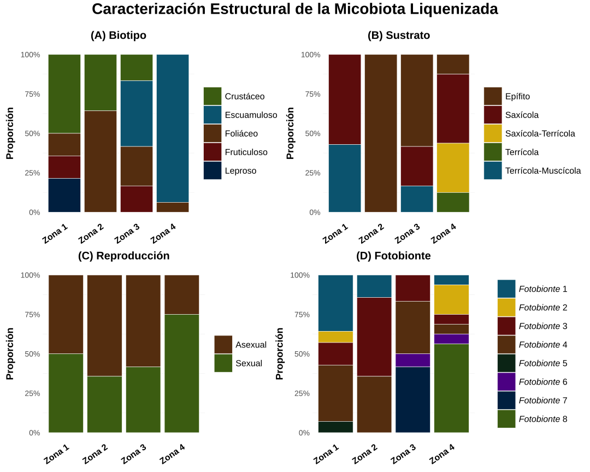
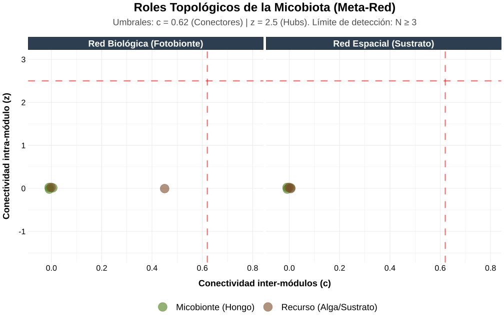
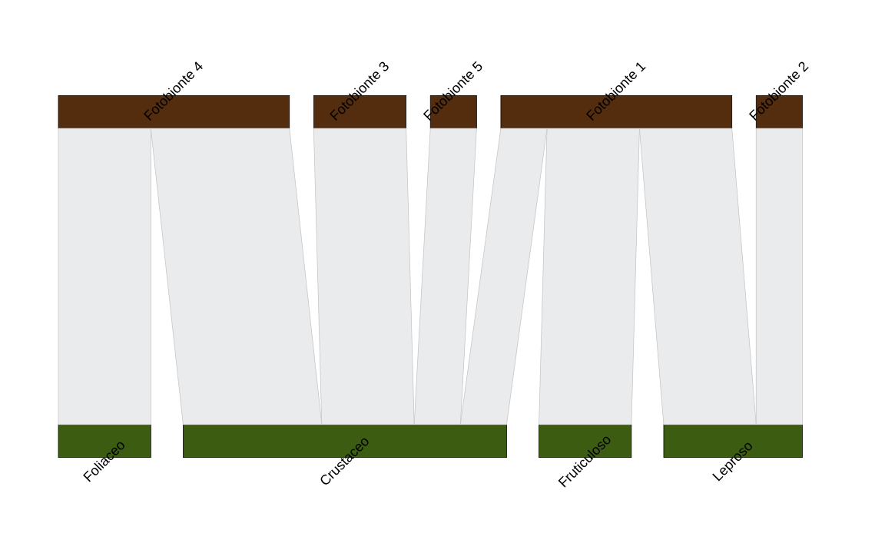

# 🍄 Lichen-Net: Diversidad taxonómica y redes de interacción mico-fotobionte
### Una aproximación funcional y multiescala

[](https://www.r-project.org/)
[](https://www.gnu.org/licenses/gpl-3.0)

**Investigadora:** Irene Mahiques Andrés  
**Especialidad:** Biología de Sistemas | Ecología Molecular  
**Institución:** Universitat de València (UV)

---

## 🎯 Resumen del Proyecto
Este repositorio documenta el flujo de trabajo desarrollado para el modelado de redes de interacción bipartitas entre micobiontes y fotobiontes en ecosistemas de la Comunidad Valenciana. 

El proyecto integra protocolos de **laboratorio molecular** (extracción y amplificación de marcadores multilocus) con un robusto **pipeline de análisis estadístico en R** para cuantificar la estabilidad y arquitectura de las simbiosis liquénicas.

---

## 🚀 Escalabilidad y Aplicaciones Transversales (Use Cases)

Aunque este pipeline fue validado con datos empíricos de simbiosis liquénicas, la arquitectura de modelado topológico y los scripts bioestadísticos son directamente extrapolables a otros campos de la **Biología de Sistemas** y la **Ciencia de Datos**:

* **Microbioma y Metagenómica:** Identificación de taxones clave (*keystone species*) en microbiotas intestinales o de suelos agronómicos mediante el análisis de roles topológicos ($z$ y $c$).
* **NAMs (New Approach Methodologies):** Modelado de interacciones bipartitas en redes de toxicología predictiva (ej. interacciones Compuesto-Proteína) para alternativas a la experimentación animal.
* **Epidemiología y Salud Pública:** Análisis de anidamiento y compartimentación en redes de transmisión huésped-patógeno.
* **Agroecología:** Cuantificación de la estabilidad y el solapamiento de nicho en redes mutualistas planta-polinizador.
  
---

## 🧬 Pipeline del Proyecto

### 1. Fase Experimental (Laboratorio Molecular)
Protocolos optimizados para la obtención de datos genómicos en organismos liquenizados:
* **Extracción de ADN:** Protocolo rápido mediante resina Chelex® 100.
* **PCR:** Marcador nuclear (ITS).
* **Purificación:** Limpieza enzimática mediante ExoCleanUp FAST®.

### 2. Fase Analítica (Ecología Computacional en R)
El flujo de trabajo se divide en 12 etapas secuenciales (disponibles en `/scripts`):

#### I. Preprocesamiento y Biodiversidad
* `01_data_cleaning.R`: Limpieza, estandarización taxonómica y manejo de *missing values*.
* `02_alpha_diversity.R`: Cálculo de índices de Shannon, Simpson y Equidad de Pielou.
* `03_rarefaction_curves.R`: Validación del esfuerzo de muestreo mediante curvas de acumulación.
* `04_beta_diversity.R`: Análisis de similitud florística (Bray-Curtis & Ward.D2).

#### II. Ecología Funcional y Modelado
* `05_structural_characterization.R`: Visualización multipanel de biotipos, sustratos y reproducción.
* `06_glm_analysis.R`: Validación estadística de diferencias mediante GLM multinomiales.
* `09_variance_partitioning.R`: Partición de varianza para determinar el peso de la geografía, biología y filogenia.

#### III. Análisis de Redes y Nichos
* `07_network_and_niche_analysis.R`: Inferencia de anidamiento (NODF) y solapamiento de nicho (*niche overlap*).
* `08_topological_roles_olesen.R`: Clasificación de especies en *Hubs* y *Conectores* (Análisis z-c).
* `12_bipartite_network_plots.R`: Generación de diagramas visuales de red en formato vectorial (SVG).

#### IV. Consolidación de Resultados
* `10_network_descriptives.R`: Extracción de KPIs (N total de muestras, nodos y enlaces).
* `11_floristic_catalogue.R`: Generación del inventario taxonómico y funcional automatizado.

---

## 📂 Estructura del Repositorio
* `/scripts`: Código fuente en R debidamente documentado.
* `/output`: Resultados visuales (SVG) y tablas de métricas generadas con **Mock Data**.
* `/data`: Archivos `.xlsx` con datos sintéticos para asegurar la reproducibilidad.

---

## 🔒 Reproducibilidad y Confidencialidad

> [!IMPORTANT]
> **Aviso sobre los Datos**
> 
> Por motivos de confidencialidad institucional, los conjuntos de datos originales no son públicos. Sin embargo, este repositorio incluye archivos en la carpeta `data/` con **datos inventados (Mock Data)** que mantienen la estructura exacta de los reales. 
> 
> Esto permite que cualquier usuario pueda ejecutar el pipeline completo y obtener las gráficas y tablas presentes en la carpeta `output/`, validando así la funcionalidad del código.

---

## 📈 Visualización de Resultados (Demo con Mock Data)

### Caracterización Estructural


### Análisis de Roles Topológicos (Olesen)


### Red de Interacción (Bipartita)


---

## 📑 Licencia y Citación (License & Citation)

Este repositorio está protegido bajo la licencia **GNU GPL v3**. El código es de código abierto, pero **cualquier obra derivada debe mantener esta misma licencia abierta y reconocer la autoría original**.

Si utiliza total o parcialmente estos scripts, funciones o metodologías para el análisis de datos en publicaciones científicas, tesis o proyectos académicos, **es obligatorio citar este trabajo** de la siguiente manera:

### Formato APA
> Mahiques-Andrés, I. (2026). *Lichen-Net: Diversidad taxonómica y redes de interacción mico-fotobionte*. Repositorio de GitHub. https://github.com/Irene-Mahiques/Data-Analysis-Lichen-Symbiosis

### Formato BibTeX
```bibtex
@software{mahiques_lichen_2026,
  author = {Mahiques Andrés, Irene},
  title = {Lichen-Net: Diversidad taxonómica y redes de interacción mico-fotobionte},
  year = {2026},
  publisher = {GitHub},
  journal = {GitHub repository},
  url = {https://github.com/Irene-Mahiques/Data-Analysis-Lichen-Symbiosis}
}
